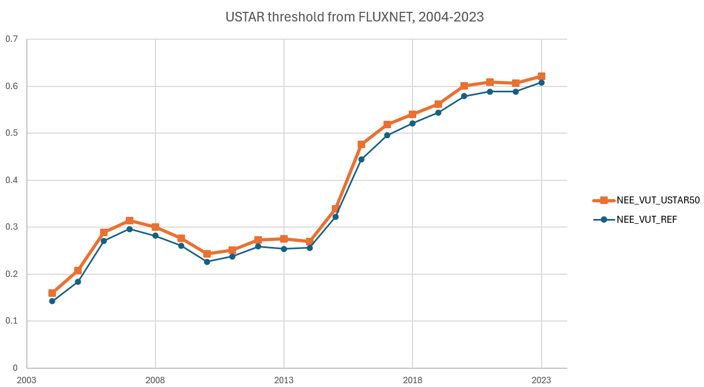

# Known Issues

## USTAR Detection

### Siginificantly changed threshold after 2015 in FLUXNET analysis
- FLUXNET uses a sophisticated approach to detect USTAR thresholds across years
- The method is described in [Pastorello et al., 2020](https://www.nature.com/articles/s41597-020-0534-3)
- In case of CH-LAE, the detected thresholds change significantly after 2015 [Fig.](plot-ustar-fluxnet1)
- At the moment, the cause of this change is unknown
- However, it coincides with a setup change: 
	- IRGA measurements were done completely with an open-path LI-7500 until 11 Jan 2016 (Phase 1, P1)
	- After that, a close-path LI-7200 was installed and run in parallel until 12 Dec 2017 (P2)
	- Starting on 14 Dec 2017, only the LI-7200 was installed (P3)
- This means the USTAR detection was done using the LI-7500 during P1.
- NEE that was used during P1 was corrected for self-heating, similar to the approach by Kittler et al., 2017

:::{figure-md} plot-ustar-fluxnet1


Results from the FLUXNET USTAR threshold detection, based on data 2004-2023. Data from the file `FLX_CH-Lae_FLUXNET2015_AUXNEE_2004-2023_1-3.csv`.
:::

`````{admonition} Notebook
:class: tip
[Sonic Anemometer](https://holukas.github.io/dataset_ch-lae_flux_product/notebooks/90_DATASET_OVERVIEW/Sonic Anemometer.html)
`````

