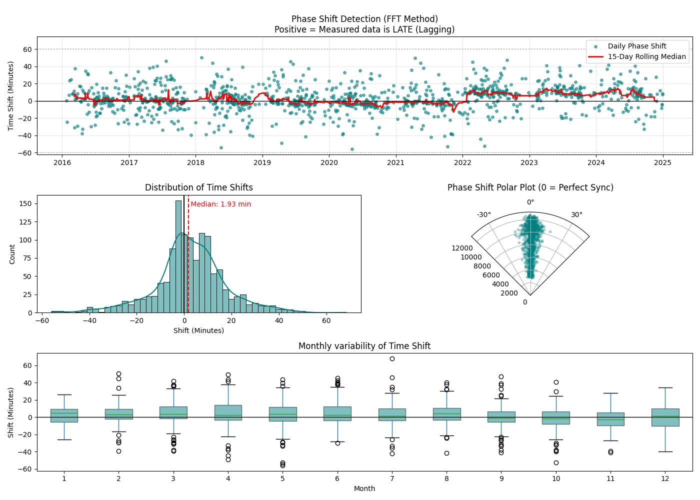

# Meteo Data

TODO IN PROGRESS

## Timeshift checks

### Summary
I checked for potential time shifts (wrong timestamps) by comparing the maximum of measured short-wave incoming radiation (SW_IN​) with the maximum potential radiation on clear-sky days (filtered for clear days, 70% of potential, to remove cloudy noise). The results show a small time lag in the `SW_IN_T1_47_1_gfXGB` variable starting in 2022, the same year the `diive` meteoscreening notebooks were deployed. To isolate the source of this offset, I performed numerous diagnostic tests on the processing steps. The extensive testing did not reveal any processing error or bug; all output values were correct.
### Details
**No time shift due to resampling.** I tested the resampling output in the `diive` meteoscreening notebook, which downloads data from the database. I resampled the original 1min data that is stored in the database to 30min for the raw data variable (with name `SW_IN_T1_47_1` in the database). At timestamp `2022-08-01 09:30:00`, the value was `654.801507`. This time range corresponds to the values between `2022-08-01 09:01:00` and `2022-08-01 09:30:00` in the original 1min raw data files. I calculated the average from the original 1min raw data files manually and got `654.8015067`. This means there is no timeshift due to resampling.

**Reproduce database value at timestamp.** I then ran the meteoscreening notebook again, but this time I also included the nighttime-offset correction (corrects for values below zero, which also changes values during daytime). The value was `665.219439`, corrected for an approx. -10 offset because of sub-zero nighttime values. The same value was also confirmed for quality-screened and nighttime-offset-corrected data downloaded from the database. 

**No error during merging.** After all different data sources for `SW_IN` were merged, the value was still the same (no error due to merging). After the merging of all `SW_IN` variables, the nighttime offset correction is run again, this time on all merged data instead of the individual data sources. After this second offset correction, the value changed to `664.929319`. Since the value became slightly lower, this means that the offset was positive (above zero during nighttime) and the respective positive offset value was subtracted. All data were then stored to a parquet file.

**No error due to middle timestamp.** During gap-filling of `SW_IN_T1_47_1` data are loaded from the parquet file. During this loading, the timestamp is converted to `TIMESTAMP_MIDDLE`. The value before gap-filling and after loading all data from the file at the corresponding middle timestamp `2022-08-01 09:15:00` (corresponding to the half-hour between 9:00 and 9:30) was `664.929319`, so up to here everything is correct. I originally assumed that an error could occur here because of the 15min shift of the middle timestamp compared to the typical timestamp that shows the end of the averaging period. 

**No error due to gap-filling.** After gap-filling `SW_IN`, the value was still the same (there was no gap in this location anyway so the value is not expected to change). After the gap-filling of other meteo variables and subsequent merging with flux data the value also remained the same (notebook 22.3). As an additional check, I manually calculated the **air temperature** value at `9:15` directly from original 1min raw data files between `09:01` and `09:30`, and the check was OK, values were identical.

**Identical results for FFT analysis.** Next I ran the FFT analysis directly using the original data file for Aug 2022, using the 1min raw data file. Then I downloaded data for Aug 2022 from the database and also ran the analysis. The results from both analyses were identical, meaning that the data in the database and in the original raw data files are the same. 

**Same results for file data and database data.** I then resampled the 1min data downloaded from the database to 30min, using the same functions as are used during the meteoscreening in `diive`, and I also created the middle timestamp for the resampled data. I then checked the value of `SW_IN_T1_47_1` at timestamp `2022-08-01 09:15`, it was `654.801507`, the same value as for the very first test described above (*No time shift due to resampling*). Running the FFT analysis on 1min raw data files or 1min data from the database yielded the same results, with a time shift median of 6.39MIN, similar to what can be seen in the [figure below](fig-phaseshiftfft-16-25) in 2022. All steps so far produced the correct results.

**Shift can be seen in original raw data files.** I checked if this offset in 2022 can also be seen in the 1min data instead of the 30min data when downloaded from the database. Above checks already confirmed that data in the database are the same as in the original raw data files. This test also showed an offset of 5.90MIN, similar to the previous test for 30MIN data. This means this shift can be confirmed for the original raw data. I also tested the FFT analysis for data Jul 2021, 1min raw data files vs 1min data from database. Both runs yielded the same result. Also the same result was achieved for 1min raw data files resampled to 30min vs 1min database data resampled to 30min.

I was not able to find any error in any of the processing steps and scripts.

(fig-phaseshiftfft-16-25)=
:::{figure-md} 

**Time shift detection in shortwave radiation** (2016–2024) using FFT phase analysis. The time shift wa calculated by comparing the phase angle of the fundamental 24-hour frequency component of measured vs potential radiation. Based on 30MIN data. (Top) Daily shifts (teal) with a 15-day rolling median (red) highlight a sensor lag emerging in 2022. (Middle) Global distribution shows a median offset of +1.93 min and strong phase alignment. (Bottom) Monthly boxplots indicate seasonal stability..
:::

