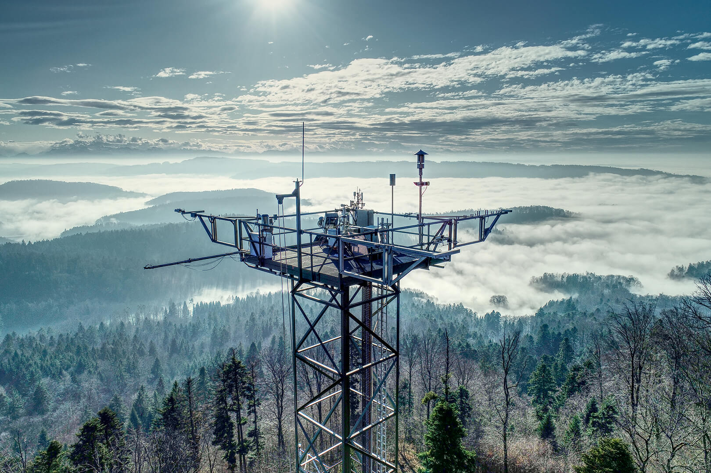
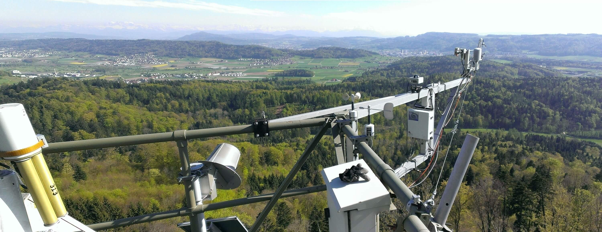
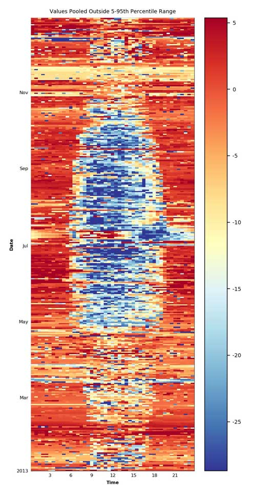

# Yearly Notes

## Info

- This page gives information about current and past flux calculations, including used software versions, and important info for each year.
- [Overview table of the setup across years](https://www.swissfluxnet.ethz.ch/index.php/sites/site-info-ch-lae/ec-raw-binary-format-ch-lae/)
- [Sheet](https://docs.google.com/spreadsheets/d/1kltV0Vuh9L1IR_z9HWqLBzEKpT6-G7C3TUN7H6uvA4A/edit?gid=0#gid=0) with processing info for recent versions
- Info about the different flux levels: [Flux Processing Chain](https://www.swissfluxnet.ethz.ch/index.php/data/ecosystem-fluxes/flux-processing-chain/)
- 
- 
- Info about some time periods is given in the form of the names of the original eddy covariance raw data files, e.g. `2019021819.C00`. 
- **TODO** **Sonic orientation/height**: Should be `7°` / `2.41m` more or less and consistent across all years. In a comparison of histograms of wind directions between 2005 and 2023 showed that a sonic orientation of `7°` offset to north yields very similar results across years all years. Info from one of the oldest setup files (`locations.table`) that were used for documenting setup info in earlier years listed the sonic orientation at `0°`. In 2016, `7°` north offset was measured for the north spar, the sonic setup should be approx. the same across all years.

### General abbreviations
- `IRGA` fluxes: CO2, H2O, H
- `FF-`: Final fluxes

### Datasets
- `Level-3-4_FLUXNET-WW2020_RELEASE-2022-1_FN-20220209`: [ICOS/FLUXNET Warm Winter 2020 ecosystem eddy covariance flux product](https://doi.org/10.18160/2G60-ZHAK) 
- `Level-3-4_FLUXNET2015-FN-20190606-beta-3`: [FLUXNET Drought-2018 ecosystem eddy covariance flux product](https://doi.org/10.18160/YVR0-4898)
- `Level-3-4_FLUXNET2015-FN-20161021`: [FLUXNET2015 Dataset](https://fluxnet.org/data/fluxnet2015-dataset/), described in [Pastorello et al. (2020)](https://doi.org/10.1038/s41597-020-0534-3)
- `Level-3-4_FLUXNET-CH4-2020_V1_2012-2016`: [FLUXNET-CH4 Community Product](https://fluxnet.org/data/fluxnet-ch4-community-product/)
- [CH-LAE FP2021 (2004-2020): PI dataset](https://www.swissfluxnet.ethz.ch/index.php/documentation/ch-lae-fp2021-2004-2020/)

## 2024

### FF-XXXX (IRGA72) [IN PROGRESS]
 
- **Final Flux Version**: R350-IRGA75_FF-202501
- **Level-1**: Level-1_FR-XXX
- **Level-4 ID(s)**: *in progress*
- **Setup**: [Setup since 2005](https://www.swissfluxnet.ethz.ch/index.php/sites/ch-cha-chamau/data-ch-cha/ec-raw-binary-format-ch-cha/)
- **Instruments**: R350, IRGA75
- **Scripts**: [bico](https://github.com/holukas/bico) v1.6.5, [fluxrun](https://github.com/holukas/fluxrun) v1.4.1 ([EddyPro](https://www.licor.com/env/products/eddy-covariance/eddypro) v7.0.9)
- **FLUXNET Upload**: 20 Apr 2025
- **Notes**:
	- [Progress notes on Google Docs](https://docs.google.com/spreadsheets/d/1KXaTtckHqOGULcr9nwL0FJ-xDnMJUFeDaXX8zh0fbJo/edit?usp=sharing)
	- calculated without angle-of-attack correction

---
## 2023

### FF-XXXX (IRGA72) [IN PROGRESS]
 
- **Final Flux Version**: R350-IRGA75_FF-202501
- **Level-1**: Level-1_FR-XXX
- **Level-4 ID(s)**: *in progress*
- **Setup**: [Setup since 2005](https://www.swissfluxnet.ethz.ch/index.php/sites/ch-cha-chamau/data-ch-cha/ec-raw-binary-format-ch-cha/)
- **Instruments**: R350, IRGA75
- **Scripts**: [bico](https://github.com/holukas/bico) v1.6.5, [fluxrun](https://github.com/holukas/fluxrun) v1.4.1 ([EddyPro](https://www.licor.com/env/products/eddy-covariance/eddypro) v7.0.9)
- **FLUXNET Upload**: 20 Apr 2025
- **Notes**:
	- [Progress notes on Google Docs](https://docs.google.com/spreadsheets/d/1KXaTtckHqOGULcr9nwL0FJ-xDnMJUFeDaXX8zh0fbJo/edit?usp=sharing)
	- calculated without angle-of-attack correction

### Deprecated versions
- **FF-202407**: Final Flux Version: HS50_IRGA72_FF-202407

---
## 2022

### FF-XXXX (IRGA72) [IN PROGRESS]
 
- **Final Flux Version**: R350-IRGA75_FF-202501
- **Level-1**: Level-1_FR-XXX
- **Level-4 ID(s)**: *in progress*
- **Setup**: [Setup since 2005](https://www.swissfluxnet.ethz.ch/index.php/sites/ch-cha-chamau/data-ch-cha/ec-raw-binary-format-ch-cha/)
- **Instruments**: R350, IRGA75
- **Scripts**: [bico](https://github.com/holukas/bico) v1.6.5, [fluxrun](https://github.com/holukas/fluxrun) v1.4.1 ([EddyPro](https://www.licor.com/env/products/eddy-covariance/eddypro) v7.0.9)
- **FLUXNET Upload**: 20 Apr 2025
- **Notes**:
	- [Progress notes on Google Docs](https://docs.google.com/spreadsheets/d/1KXaTtckHqOGULcr9nwL0FJ-xDnMJUFeDaXX8zh0fbJo/edit?usp=sharing)
	- calculated without angle-of-attack correction

### Deprecated versions
- **FF-202306**: Final Flux Version: HS50_IRGA72_FF-202306

---
## 2021

### FF-XXXX (IRGA72) [IN PROGRESS]
 
- **Final Flux Version**: R350-IRGA75_FF-202501
- **Level-1**: Level-1_FR-XXX
- **Level-4 ID(s)**: *in progress*
- **Setup**: [Setup since 2005](https://www.swissfluxnet.ethz.ch/index.php/sites/ch-cha-chamau/data-ch-cha/ec-raw-binary-format-ch-cha/)
- **Instruments**: R350, IRGA75
- **Scripts**: [bico](https://github.com/holukas/bico) v1.6.5, [fluxrun](https://github.com/holukas/fluxrun) v1.4.1 ([EddyPro](https://www.licor.com/env/products/eddy-covariance/eddypro) v7.0.9)
- **FLUXNET Upload**: 20 Apr 2025
- **Notes**:
	- [Progress notes on Google Docs](https://docs.google.com/spreadsheets/d/1KXaTtckHqOGULcr9nwL0FJ-xDnMJUFeDaXX8zh0fbJo/edit?usp=sharing)
	- calculated without angle-of-attack correction

---
## 2020

### FF-XXXX

### Deprecated versions
- **FF-202101**: Final Flux Version: HS50-IRGA72_FF-202101 | Level-1 ID: Level-1_FR-20210419-120722 | Level-4 ID(s): [CH-LAE FP2021 (2004-2020)](https://www.swissfluxnet.ethz.ch/index.php/documentation/ch-lae-fp2021-2004-2020/) (PI dataset), [Level-3-4_FLUXNET-WW2020_RELEASE-2022-1_FN-20220209](https://www.icos-cp.eu/data-products/2G60-ZHAK) | Setup: [Setup since 2004](https://www.swissfluxnet.ethz.ch/index.php/sites/ch-lae-laegeren/data-ch-lae/ec-raw-binary-format-ch-lae/) | Instruments: HS50, IRGA72 | Scripts: [EddyPro](https://www.licor.com/env/products/eddy_covariance/eddypro) 7.0.6 (Level-1), [BICO](https://gitlab.ethz.ch/holukas/bico) v0.5.0, [FLUXRUN](https://gitlab.ethz.ch/holukas/fluxrun) v0.5.0, [DIIVE](https://gitlab.ethz.ch/holukas/diive) v0.17.0, [ReddyProc](https://cran.r-project.org/web/packages/REddyProc/index.html) 1.2 (post-processing PI dataset) | FLUXNET upload: 09 Jun 2021 (Level-1) | Notes: Fluxes have been updated during the creation of the PI dataset [CH-LAE FP2021 (2004-2020)](https://www.swissfluxnet.ethz.ch/index.php/documentation/ch-lae-fp2021-2004-2020/). Fluxes from the open-path LI-7500 (IRGA75) have been corrected for self-heating. Info about the PI dataset: [CH-LAE FP2021 (2004-2020)](https://www.swissfluxnet.ethz.ch/index.php/documentation/ch-lae-fp2021-2004-2020/) Info about the different flux levels: [Flux Processing Chain](https://www.swissfluxnet.ethz.ch/index.php/data/ecosystem-fluxes/flux-processing-chain/)
- **FF-202008**: Final Flux Version: FF-202008 | Level-1 ID: Level-1_ID2020-08-12T001439 | Level-4 ID(s): Level-3-4_FLUXNET2015-WW2020-FN-20201217_beta-3_2004-2020.06 | Setup: [Setup since 2004](https://www.swissfluxnet.ethz.ch/index.php/sites/ch-lae-laegeren/data-ch-lae/ec-raw-binary-format-ch-lae/) | Time Period(s): 2020 (until incl. 30 Jun 2020) | Instruments: HS50, IRGA72 | Scripts: [FCT 0.9.6](https://gitlab.ethz.ch/holukas/fct-flux-calculation-tool/-/releases/v0.9.6),  [EddyPro](https://www.licor.com/env/products/eddy_covariance/eddypro) 7.0.6, [DIIVE](https://gitlab.ethz.ch/holukas/diive) v0.16.0 | FLUXNET upload: 13 Aug 2020 (Level-1) | Notes: Fluxes were re-calculated and now include all fluxes until 30 Jun 2020, needed for ICOS Winter 2020 Initiative; For more info see here: [CH-MULTI / FF-202008](https://www.swissfluxnet.ethz.ch/index.php/documentation/ch-multi-ff-202008/).
- **FF-202006**: Final Flux Version: FF-202006 | Level-1 ID: Level-1_ID2020-06-15T110137 | Level-1.1 ID: - (no self-heating correction applied) | Level-4 ID(s): Level-3-4_FLUXNET2015-WW2020-FN-20201217_beta-3_2004-2020.06 | Setup: [Setup since 2004](https://www.swissfluxnet.ethz.ch/index.php/sites/ch-lae-laegeren/data-ch-lae/ec-raw-binary-format-ch-lae/) | Time Period(s): 2020 (until incl. 31 May 2020) | Instruments: HS50, IRGA72 | Scripts: [FCT 0.9.6](https://gitlab.ethz.ch/holukas/fct-flux-calculation-tool/-/releases/v0.9.6) with [EddyPro](https://www.licor.com/env/products/eddy_covariance/eddypro) v7.0.6 (Level-1), [FQC 2.1.2](https://gitlab.ethz.ch/holukas/fqc-flux-quality-control/-/releases/v2.1.2) (Level-2) | FLUXNET upload: not uploaded (originally thought to be for ICOS Winter 2020 Initiative) | Notes: Level-1 fluxes up until incl. 31 May 2020, but screened meteo data available until incl. 27 May 2020 13:30, therefore Level-2 fluxes were only considered until this date; Fluxes were intended for the ICOS Winter 2020 dataset, but were ultimately not used. Instead, FF-202008 (see above) with a longer time period was uploaded; For more info, see CH-LAE / FF-202006

---
## 2019

:::{figure-md} photo-ec2

The research site CH-LAE in Dec 2019. Photo: Markus Staudinger, Grassland Sciences Group, ETH Zurich
:::

## FF-XXXX

### Deprecated versions
- **FF-202101**: Final Flux Version: HS50-IRGA72-IRGA75_FF-202101 | Level-1 ID: Level-1_DIIVE-20210607-093449 (merged results from Level-1 IRGA72 fluxes and Level-1.1 IRGA75 fluxes) | Level-1.1: (only IRGA75) [CH-LAE FP2021 (2004-2020)](https://www.swissfluxnet.ethz.ch/index.php/documentation/ch-lae-fp2021-2004-2020/) | Level-4 ID(s): [CH-LAE FP2021 (2004-2020)](https://www.swissfluxnet.ethz.ch/index.php/documentation/ch-lae-fp2021-2004-2020/) (PI dataset), [Level-3-4_FLUXNET-WW2020_RELEASE-2022-1_FN-20220209](https://www.icos-cp.eu/data-products/2G60-ZHAK) | Setup: [Setup since 2004](https://www.swissfluxnet.ethz.ch/index.php/sites/ch-lae-laegeren/data-ch-lae/ec-raw-binary-format-ch-lae/) | Time Period(s): 2019 (complete year) | Instruments: HS50, IRGA72, IRGA75 | Scripts: [EddyPro](https://www.licor.com/env/products/eddy_covariance/eddypro) 7.0.6 (Level-1), [FCT](https://gitlab.ethz.ch/holukas/fct-flux-calculation-tool) 0.9.6, [DIIVE](https://gitlab.ethz.ch/holukas/diive) v0.19.0-alpha, [ReddyProc](https://cran.r-project.org/web/packages/REddyProc/index.html) 1.2 (post-processing PI dataset) | FLUXNET upload: 09 Jun 2021 (merged Level-1 IRGA72 and Level-1.1 IRGA75 fluxes for full FLUXNET Warm Winter 2020 dataset) | Notes: For the time period 2019_3, IRGA75 fluxes (corrected for self-heating) were used. The used fluxes are originally from FF-202006 / Level-1_ID2020-06-27T001433 (see below), however for this release the IRGA75 fluxes of the same run were corrected for self-heating. Fluxes have been updated during the creation of the PI dataset [CH-LAE FP2021 (2004-2020)](https://www.swissfluxnet.ethz.ch/index.php/documentation/ch-lae-fp2021-2004-2020/). Info about the PI dataset: [CH-LAE FP2021 (2004-2020)](https://www.swissfluxnet.ethz.ch/index.php/documentation/ch-lae-fp2021-2004-2020/) Info about the different flux levels: [Flux Processing Chain](https://www.swissfluxnet.ethz.ch/index.php/data/ecosystem-fluxes/flux-processing-chain/)
- **FF-202006**: Final Flux Version: HS50-IRGA75-IRGA72_FF-202006 | Level-1 ID: Level-1_ID2020-06-27T001433 | Level-1.1 ID: - (no self-heating correction applied) | Level-4 ID(s): Level-3-4_FLUXNET2015-WW2020-FN-20201217_beta-3_2004-2020.06 | Setup: [Setup since 2004](https://www.swissfluxnet.ethz.ch/index.php/sites/ch-lae-laegeren/data-ch-lae/ec-raw-binary-format-ch-lae/) | Time Period(s): 2019 (complete year) | Instruments: HS50, IRGA75, IRGA72 | Scripts: [FCT 0.9.6](https://gitlab.ethz.ch/holukas/fct-flux-calculation-tool/-/releases/v0.9.6) with EP 7.0.6 (Level-1), [FIME 1.0.0](https://gitlab.ethz.ch/holukas/fime-file-merger/-/releases/v1.0.0) (merging Level-1), [FQC 2.1.1](https://gitlab.ethz.ch/holukas/fqc-flux-quality-control/-/releases/v2.1.1) (Level-2), Amp v0.16.0 | FLUXNET upload: 13 Aug 2020 (Level-1) | Notes: Fluxes have been corrected for the [Wrong Calibration Gas 2017](https://www.swissfluxnet.ethz.ch/index.php/documentation/wrong-calibration-gas-2017/) issue. See here for affected time periods: [Setup since 2004](https://www.swissfluxnet.ethz.ch/index.php/sites/ch-lae-laegeren/data-ch-lae/ec-raw-binary-format-ch-lae/).

---
## 2018

### FF-XXXX

### Deprecated versions
- **FF-202101**: Final Flux Version: HS50-IRGA72_FF-202101 |  Level-1 ID: Level-1_DIIVE-20210607-093447 |  Level-4 ID(s): [CH-LAE FP2021 (2004-2020)](https://www.swissfluxnet.ethz.ch/index.php/documentation/ch-lae-fp2021-2004-2020/) (PI dataset) [Level-3-4_FLUXNET-WW2020_RELEASE-2022-1_FN-20220209](https://www.icos-cp.eu/data-products/2G60-ZHAK) | Setup: [Setup since 2004](https://www.swissfluxnet.ethz.ch/index.php/sites/ch-lae-laegeren/data-ch-lae/ec-raw-binary-format-ch-lae/) | Time Period(s): 2018 (complete year) | Instruments: HS50, IRGA72 | Scripts: [EddyPro](https://www.licor.com/env/products/eddy_covariance/eddypro) 7.0.6 (Level-1), [BICO](https://gitlab.ethz.ch/holukas/bico) v0.5.1, [FLUXRUN](https://gitlab.ethz.ch/holukas/fluxrun) v0.5.0, [DIIVE](https://gitlab.ethz.ch/holukas/diive) v0.19.0-alpha, [ReddyProc](https://cran.r-project.org/web/packages/REddyProc/index.html) 1.2 (post-processing PI dataset) | FLUXNET upload: 09 Jun 2021 (Level-1) | Notes: Fluxes for the following time periods were removed from the dataset due to issues with the IRGA72 flowrate (in FP2021 they were removed in Level-2 fluxes): CO2 flux: between 19 May and 6 Jun 2018. Water fluxes H2O flux / LE / ET: between 13 May and 6 Jun 2018 (in FP2021 only needed for LE) Fluxes have been corrected for the usage of a [Wrong Calibration Gas](https://www.swissfluxnet.ethz.ch/index.php/documentation/wrong-calibration-gas-2017/). Fluxes have been updated during the creation of the PI dataset [CH-LAE FP2021 (2004-2020)](https://www.swissfluxnet.ethz.ch/index.php/documentation/ch-lae-fp2021-2004-2020/). Info about the PI dataset: [CH-LAE FP2021 (2004-2020)](https://www.swissfluxnet.ethz.ch/index.php/documentation/ch-lae-fp2021-2004-2020/) Info about the different flux levels: [Flux Processing Chain](https://www.swissfluxnet.ethz.ch/index.php/data/ecosystem-fluxes/flux-processing-chain/)
- **FF-201902**: Final Flux Version: HS50-IRGA72_FF-201902 | Level-1 ID: Level-1_ID2019-01-15T155533 | Level-4 ID(s): Level-3-4_FLUXNET2015-FN-20190607-beta-3_2004-2018; Level-3-4_FLUXNET2015-WW2020-FN-20201217_beta-3_2004-2020.06 | Setup: [Setup since 2004](https://www.swissfluxnet.ethz.ch/index.php/sites/ch-lae-laegeren/data-ch-lae/ec-raw-binary-format-ch-lae/) | Time Period(s): 2018 (complete year) | Instruments: HS50, IRGA72 | Scripts: [FCT](https://gitlab.ethz.ch/holukas/fct-flux-calculation-tool) 0.85, [EddyPro](https://www.licor.com/env/products/eddy_covariance/eddypro) 6.2.0 (Level-1), [FQC](https://gitlab.ethz.ch/holukas/fqc-flux-quality-control) (Level-2) | FLUXNET upload: 6 May 2019 (Level-1) | Notes: Known issues: 1. Fluxes have not been corrected for the [Wrong Calibration Gas 2017](https://www.swissfluxnet.ethz.ch/index.php/documentation/wrong-calibration-gas-2017/) issue (unknown at the time). See here for affected time periods: [Setup since 2004](https://www.swissfluxnet.ethz.ch/index.php/sites/ch-lae-laegeren/data-ch-lae/ec-raw-binary-format-ch-lae/). 2. EPL, Feb 2019: "Following our QAQC meeting this morning, I checked the notes I had made for Lae, and thanks to PM for mentioning the possible Flow issue. The flow of the LI-7200 was obstructed from May 31st to June 7th, which leads to faulty fluxes. @MG: If you use these data please flag that period as 2 or replace with -9999 values (it will affect the CO2 and H2O fluxes). I will take care of correcting this with the EFDC. However, this is something we should address since more of the sites are using LI-7200 and this is not picked up in the normal quality flagging."

---
## 2017

### FF-XXXX

### Deprecated versions
- **FF-202101** | Final Flux Version: HS50-IRGA72-IRGA75_FF-202101 |  Level-1 ID: Level-1_DIIVE-20210606-105902 (merged results from Level-1 IRGA72 fluxes and Level-1.1 IRGA75 fluxes), Level-1_2017_1_2_IRGA72_FR-20210423-160035, Level-1.1_2017_IRGA75_DIIVE-20210606-105901 | Level-1.1 ID: (only IRGA75) [CH-LAE FP2021 (2004-2020)](https://www.swissfluxnet.ethz.ch/index.php/documentation/ch-lae-fp2021-2004-2020/) | Level-4 ID(s): [CH-LAE FP2021 (2004-2020)](https://www.swissfluxnet.ethz.ch/index.php/documentation/ch-lae-fp2021-2004-2020/) (PI dataset) [Level-3-4_FLUXNET-WW2020_RELEASE-2022-1_FN-20220209](https://www.icos-cp.eu/data-products/2G60-ZHAK) | Setup: [Setup since 2004](https://www.swissfluxnet.ethz.ch/index.php/sites/ch-lae-laegeren/data-ch-lae/ec-raw-binary-format-ch-lae/) | Time Period(s): 2017 (complete year) | Instruments: HS50, IRGA75, IRGA72 | Scripts: [EddyPro](https://www.licor.com/env/products/eddy_covariance/eddypro) 7.0.6 (Level-1), [BICO](https://gitlab.ethz.ch/holukas/bico) v0.5.1, [FLUXRUN](https://gitlab.ethz.ch/holukas/fluxrun) v0.5.0, [DIIVE](https://gitlab.ethz.ch/holukas/diive) v0.19.0-alpha, [SCOP](https://gitlab.ethz.ch/holukas/scop) v0.1 (self-heating correction), [ReddyProc](https://cran.r-project.org/web/packages/REddyProc/index.html) 1.2 (post-processing PI dataset) |  FLUXNET upload: 09 Jun 2021 (merged Level-1 IRGA72 and Level-1.1 IRGA75 fluxes for full FLUXNET Warm Winter 2020 dataset) | Notes: IRGA72 fluxes are prioritized. Gaps (only few) in IRGA72 fluxes were gap-filled with IRGA75 fluxes (corrected for self-heating), if IRGA75 fluxes were available in these gaps. Separate Level-1 fluxes for IRGA72 and IRGA75 are available in HS50-IRGA72-IRGA75_FF-202101. For IRGA75, Level-1.1 fluxes are also available. The short time period at the end of the year that is affected by the [Wrong Calibration Gas](https://www.swissfluxnet.ethz.ch/index.php/documentation/wrong-calibration-gas-2017/) has been corrected. Fluxes have been updated during the creation of the PI dataset [CH-LAE FP2021 (2004-2020)](https://www.swissfluxnet.ethz.ch/index.php/documentation/ch-lae-fp2021-2004-2020/). Fluxes from the open-path LI-7500 (IRGA75) have been corrected for self-heating. Info about the PI dataset: [CH-LAE FP2021 (2004-2020)](https://www.swissfluxnet.ethz.ch/index.php/documentation/ch-lae-fp2021-2004-2020/) Info about the different flux levels: [Flux Processing Chain](https://www.swissfluxnet.ethz.ch/index.php/data/ecosystem-fluxes/flux-processing-chain/)
- **FF-201902**: Final Flux Version: FF-201902 | Level-1 ID: Level-1_ID2018-03-02T095006 | Level-4 ID(s): Level-3-4_FLUXNET2015-FN-20190607-beta-3_2004-2018; Level-3-4_FLUXNET2015-WW2020-FN-20201217_beta-3_2004-2020.06 | Setup: [Setup since 2004](https://www.swissfluxnet.ethz.ch/index.php/sites/ch-lae-laegeren/data-ch-lae/ec-raw-binary-format-ch-lae/) | Time Period(s): 2017 (only IRGA72 used, complete year) | Instruments: HS50, IRGA72 | Scripts: [FCT](https://gitlab.ethz.ch/holukas/fct-flux-calculation-tool) 0.74, [EddyPro](https://www.licor.com/env/products/eddy_covariance/eddypro) 6.1.0 (Level-1), [FQC](https://gitlab.ethz.ch/holukas/fqc-flux-quality-control) (Level-2) | FLUXNET upload: 23 May 2019 (Level-1) | Notes: Known issues: Fluxes have not been corrected for the [Wrong Calibration Gas 2017](https://www.swissfluxnet.ethz.ch/index.php/documentation/wrong-calibration-gas-2017/) issue (unknown at the time). See here for affected time periods: [Setup since 2004](https://www.swissfluxnet.ethz.ch/index.php/sites/ch-lae-laegeren/data-ch-lae/ec-raw-binary-format-ch-lae/). However, this issue only affects the last approx. 2 weeks of December, a correction might therefore not be worthwhile since this has virtually zero impact on CO2 budgets etc; Unfortunately I did not have all details available, but from the file in the database upload I concluded the the IRGA72 fluxes were uploaded. -LH; Some files are missing in the output folder (the converted raw data csv files and raw data csv plots); The Level-2 fluxes are missing, but data were uploaded; There was no log file available, therefore the used versions of FCT and EddyPro are unknown (probably FCT 0.74, EP 6.1.0).**

---
## 2016

### FF-202101

- **Final Flux Version**: HS50-IRGA72-IRGA75_FF-202101
- **Level-1 ID**:
    - Level-1_DIIVE-20210606-105901 (merged results from Level-1 IRGA72 fluxes and Level-1.1 IRGA75 fluxes)
        - Level-1_2016_2_3_IRGA72_FR-20210424-013350
        - Level-1.1_2016_IRGA75_DIIVE-20210606-105901
- **Level-1.1 ID**: (only IRGA75) [CH-LAE FP2021 (2004-2020)](https://www.swissfluxnet.ethz.ch/index.php/documentation/ch-lae-fp2021-2004-2020/)
- **Level-4 ID(s)**:
    - [CH-LAE FP2021 (2004-2020)](https://www.swissfluxnet.ethz.ch/index.php/documentation/ch-lae-fp2021-2004-2020/) (PI dataset)
    - [Level-3-4_FLUXNET-WW2020_RELEASE-2022-1_FN-20220209](https://www.icos-cp.eu/data-products/2G60-ZHAK)
- **Setup**: [Setup since 2004](https://www.swissfluxnet.ethz.ch/index.php/sites/ch-lae-laegeren/data-ch-lae/ec-raw-binary-format-ch-lae/)
- **Time Period(s)**: 2016 (complete year)
- **Instruments**: HS50, IRGA75, IRGA72
- **Scripts**: [EddyPro](https://www.licor.com/env/products/eddy_covariance/eddypro) 7.0.6 (Level-1), [BICO](https://gitlab.ethz.ch/holukas/bico) v0.5.1, [FLUXRUN](https://gitlab.ethz.ch/holukas/fluxrun) v0.5.0, [DIIVE](https://gitlab.ethz.ch/holukas/diive) v0.19.0-alpha, [SCOP](https://gitlab.ethz.ch/holukas/scop) v0.1 (self-heating correction), [ReddyProc](https://cran.r-project.org/web/packages/REddyProc/index.html) 1.2 (post-processing PI dataset)
- **FLUXNET upload**: 09 Jun 2021 (merged Level-1 IRGA72 and Level-1.1 IRGA75 fluxes for full FLUXNET Warm Winter 2020 dataset)
- **Notes**:
    - IRGA72 fluxes are not available for the beginning few months of the year. These gaps in the first half of the year and other IRGA72 gaps throughout the rest of the year were filled with IRGA75 fluxes (corrected for self-heating), if IRGA75 fluxes were available in these gaps.
    - Separate Level-1 fluxes for IRGA72 and IRGA75 are available in HS50-IRGA72-IRGA75_FF-202101. For IRGA75, Level-1.1 fluxes are also available.
    - Fluxes have been updated during the creation of the PI dataset [CH-LAE FP2021 (2004-2020)](https://www.swissfluxnet.ethz.ch/index.php/documentation/ch-lae-fp2021-2004-2020/).
    - Fluxes from the open-path LI-7500 (IRGA75) have been corrected for self-heating.
    - Info about the PI dataset: [CH-LAE FP2021 (2004-2020)](https://www.swissfluxnet.ethz.ch/index.php/documentation/ch-lae-fp2021-2004-2020/)
    - Info about the different flux levels: [Flux Processing Chain](https://www.swissfluxnet.ethz.ch/index.php/data/ecosystem-fluxes/flux-processing-chain/)

### Deprecated versions
- **FF-201902**: Final Flux Version: FF-201902 | Level-1 ID: Level-1_ID2017-02-10T101729 | Level-1.1 ID: - (no self-heating correction applied) | Level-4 ID(s): Level-3-4_FLUXNET2015-FN-20190607-beta-3_2004-2018; Level-3-4_FLUXNET2015-WW2020-FN-20201217_beta-3_2004-2020.06 | Setup: [Setup since 2004](https://www.swissfluxnet.ethz.ch/index.php/sites/ch-lae-laegeren/data-ch-lae/ec-raw-binary-format-ch-lae/) | Time Period(s): 2016 (only IRGA75 used, complete year) | Instruments: HS50, IRGA75 | Scripts: [FCT](https://gitlab.ethz.ch/holukas/fct-flux-calculation-tool) 0.74, [EddyPro](https://www.licor.com/env/products/eddy_covariance/eddypro) 6.1.0 (Level-1), [FQC](https://gitlab.ethz.ch/holukas/fqc-flux-quality-control) (Level-2) | FLUXNET upload: 23 May 2019 (Level-1) | Notes: In this version, no self-heating correction was applied to Level-1 fluxes; Unfortunately I did not have all details available, but from the file in the database upload I concluded the the IRGA75 fluxes were uploaded. -LH

---
## 2015

### FF-201606

- **Final Flux Version**: HS50-IRGA75_FF-201606
- **Level-1 ID**: Level-1_ID2016-06-10T163549
- **Level-1.1 ID**: [CH-LAE FP2021 (2004-2020)](https://www.swissfluxnet.ethz.ch/index.php/documentation/ch-lae-fp2021-2004-2020/)
- **Level-4 ID(s)**:
    - [CH-LAE FP2021 (2004-2020)](https://www.swissfluxnet.ethz.ch/index.php/documentation/ch-lae-fp2021-2004-2020/) (PI dataset)
    - [Level-3-4_FLUXNET-WW2020_RELEASE-2022-1_FN-20220209](https://www.icos-cp.eu/data-products/2G60-ZHAK)
- **Setup**: [Setup since 2004](https://www.swissfluxnet.ethz.ch/index.php/sites/ch-lae-laegeren/data-ch-lae/ec-raw-binary-format-ch-lae/)
- **Time Period(s)**: 2015 (complete year)
- **Instruments**: HS50, IRGA75
- **Scripts**: [EddyPro](https://www.licor.com/env/products/eddy_covariance/eddypro) 6.1.0 (Level-1), [DIIVE](https://gitlab.ethz.ch/holukas/diive) v0.19.0-alpha, [SCOP](https://gitlab.ethz.ch/holukas/scop) v0.1 (self-heating correction), [ReddyProc](https://cran.r-project.org/web/packages/REddyProc/index.html) 1.2 (post-processing PI dataset)
- **FLUXNET upload**: 09 Jun 2021 (Level-1.1)
- **Notes**:
    - Fluxes have been updated during the creation of the PI dataset [CH-LAE FP2021 (2004-2020)](https://www.swissfluxnet.ethz.ch/index.php/documentation/ch-lae-fp2021-2004-2020/).
    - Fluxes from the open-path LI-7500 (IRGA75) have been corrected for self-heating.
    - Info about the PI dataset: [CH-LAE FP2021 (2004-2020)](https://www.swissfluxnet.ethz.ch/index.php/documentation/ch-lae-fp2021-2004-2020/)

### Deprecated versions
- **FF-201606**: Final Flux Version: FF-201606 | Level-1 ID: Level-1_ID2016-06-10T163549 | Level-1.1 ID: - (no self-heating correction applied) | Level-4 ID(s): Level-3-4_FLUXNET2015-FN-20190607-beta-3_2004-2018; Level-3-4_FLUXNET2015-WW2020-FN-20201217_beta-3_2004-2020.06 | Setup: [Setup since 2004](https://www.swissfluxnet.ethz.ch/index.php/sites/ch-lae-laegeren/data-ch-lae/ec-raw-binary-format-ch-lae/) | Time Period(s): 2015 (complete year) | Instruments: HS50, IRGA75 | Scripts: [FCT](https://gitlab.ethz.ch/holukas/fct-flux-calculation-tool) 0.74, [EddyPro](https://www.licor.com/env/products/eddy_covariance/eddypro) 6.1.0 (Level-1), [FQC](https://gitlab.ethz.ch/holukas/fqc-flux-quality-control) (Level-2) | FLUXNET upload: 30 Jun 2016 (Level-1, for FLUXNET2015 dataset, but were not included since that dataset only considered fluxes until incl. 2014) | Notes: In this version, no self-heating correction was applied to Level-1 fluxes; Like for other sites, the 2015 fluxes were uploaded for the FLUXNET2015 dataset in 2016. However, the FLUXNET2015 dataset generally only comprises fluxes until incl. 2014, i.e. 2015 fluxes were not included. Fluxes for 2015 were then later included in the update of the dataset during the data collection for the drought study in 2019.

---
## 2014

:::{figure-md} photo-ec3

The research site CH-LAE on 17 Apr 2014. Photo: Grassland Sciences Group, ETH Zurich
:::

### FF-201606

- **Final Flux Version**: HS50-IRGA75_FF-201606
- **Level-1 ID**: Level-1_ID2016-06-10T163622
- **Level-1.1 ID**: [CH-LAE FP2021 (2004-2020)](https://www.swissfluxnet.ethz.ch/index.php/documentation/ch-lae-fp2021-2004-2020/)
- **Level-4 ID(s)**:
    - [CH-LAE FP2021 (2004-2020)](https://www.swissfluxnet.ethz.ch/index.php/documentation/ch-lae-fp2021-2004-2020/) (PI dataset)
    - [Level-3-4_FLUXNET-WW2020_RELEASE-2022-1_FN-20220209](https://www.icos-cp.eu/data-products/2G60-ZHAK)
- **Setup**: [Setup since 2004](https://www.swissfluxnet.ethz.ch/index.php/sites/ch-lae-laegeren/data-ch-lae/ec-raw-binary-format-ch-lae/)
- **Time Period(s)**: 2014 (complete year)
- **Instruments**: HS50, IRGA75
- **Scripts**: [EddyPro](https://www.licor.com/env/products/eddy_covariance/eddypro) 6.1.0 (Level-1), [DIIVE](https://gitlab.ethz.ch/holukas/diive) v0.19.0-alpha, [SCOP](https://gitlab.ethz.ch/holukas/scop) v0.1 (self-heating correction), [ReddyProc](https://cran.r-project.org/web/packages/REddyProc/index.html) 1.2 (post-processing PI dataset)
- **FLUXNET upload**: 09 Jun 2021 (Level-1.1)
- **Notes**:
    - Fluxes have been updated during the creation of the PI dataset [CH-LAE FP2021 (2004-2020)](https://www.swissfluxnet.ethz.ch/index.php/documentation/ch-lae-fp2021-2004-2020/).
    - Fluxes from the open-path LI-7500 (IRGA75) have been corrected for self-heating.
    - Info about the PI dataset: [CH-LAE FP2021 (2004-2020)](https://www.swissfluxnet.ethz.ch/index.php/documentation/ch-lae-fp2021-2004-2020/)

### Deprecated versions
- **FF-201606**: Final Flux Version: FF-201606 | Level-1 ID: Level-1_ID2016-06-10T163622 | Level-1.1 ID: - (no self-heating correction applied) | Level-4 ID(s): Level-3-4_FLUXNET2015-FN-20161021_2004-2014; Level-3-4_FLUXNET2015-FN-20190607-beta-3_2004-2018; Level-3-4_FLUXNET2015-WW2020-FN-20201217_beta-3_2004-2020.06 | Setup: [Setup since 2004](https://www.swissfluxnet.ethz.ch/index.php/sites/ch-lae-laegeren/data-ch-lae/ec-raw-binary-format-ch-lae/) | Time Period(s): 2014 (complete year) | Instruments: HS50, IRGA75 | Scripts: [FCT](https://gitlab.ethz.ch/holukas/fct-flux-calculation-tool) 0.74, [EddyPro](https://www.licor.com/env/products/eddy_covariance/eddypro) 6.1.0 (Level-1), [FQC](https://gitlab.ethz.ch/holukas/fqc-flux-quality-control) (Level-2) | FLUXNET upload: 30 Jun 2016 (Level-1) | Notes: In this version, no self-heating correction was applied to Level-1 fluxes.

---
## 2013

### General notes
- ==TODO== **ISSUE: SHIFTED TIMESTAMP**: 
	- **Affected time period**: between `2013070615.b02` and (incl.) `2013071214.b00`
	- The timestamp in the EC raw data files was shifted between 6 Jul 2013 and 12 Jul 2013. There was (is?) an error in the raw binary filename timestamp between 2013-07-06 and 2013-07-12. Relevant fieldbook entry: “2013-07-12: time on moxa was wrong. changed on 16:44 from 22:43:50 to 15:44”, i.e. 6 hours + I renamed all files from `2013070615.b02` until (incl.) `2013071214.b00` manually by *subtracting 6 hours*. For example: 2013070802.b00 was renamed to 2013070720.b00. In case of flux calculations it needs to be checked if the time error still persists. 
	- ==TODO== **Update Jul 2025**: Error still persists, the original raw data files have the wrong start time in their filenames. I renamed the files like described above after the conversion to ASCII using bico. Fluxes were then calculated using the renamed files for that period.
	- During the generation of the PI dataset [CH-LAE FP2021 (2004-2020)](https://www.swissfluxnet.ethz.ch/index.php/documentation/ch-lae-fp2021-2004-2020/) this error still needed correction after fluxes were calculated: “_In the IRGA75 Level-1 fluxes, the timestamp of flux variables between 6 Jul and 12 Jul 2013 (6 days) was shifted by approx. 14.5 hours. Affected time range: between 2013-07-06 15:45 and 2013-07-12 23:45. For example, data at timestamp 2013-07-06 15:45 is really 2013-07-06 08:15. Level-1 data were shifted accordingly. Then, the transition day 2013-07-12 was set to missing._“

:::{figure-md} photo-ec1

CH-LAE 2013: Shifted timestamp in July 2013, flux version Level-3-4_FLUXNET2015-FN-20190607-beta-3
:::

### FF-201606

- **Final Flux Version**: HS50-IRGA75_FF-201606
- **Level-1 ID**: Level-1_ID2016-06-10T163630c (**corrected for timestamp shift, see notes**)
- **Level-1.1 ID**: [CH-LAE FP2021 (2004-2020)](https://www.swissfluxnet.ethz.ch/index.php/documentation/ch-lae-fp2021-2004-2020/)
- **Level-4 ID(s)**:
    - [CH-LAE FP2021 (2004-2020)](https://www.swissfluxnet.ethz.ch/index.php/documentation/ch-lae-fp2021-2004-2020/) (PI dataset)
    - [Level-3-4_FLUXNET-WW2020_RELEASE-2022-1_FN-20220209](https://www.icos-cp.eu/data-products/2G60-ZHAK)
- **Setup**: [Setup since 2004](https://www.swissfluxnet.ethz.ch/index.php/sites/ch-lae-laegeren/data-ch-lae/ec-raw-binary-format-ch-lae/)
- **Time Period(s)**: 2013 (complete year)
- **Instruments**: HS50, IRGA75
- **Scripts**: [EddyPro](https://www.licor.com/env/products/eddy_covariance/eddypro) 6.1.0 (Level-1), [DIIVE](https://gitlab.ethz.ch/holukas/diive) v0.19.0-alpha, [SCOP](https://gitlab.ethz.ch/holukas/scop) v0.1 (self-heating correction), [ReddyProc](https://cran.r-project.org/web/packages/REddyProc/index.html) 1.2 (post-processing PI dataset)
- **FLUXNET upload**: 09 Jun 2021 (Level-1.1)
- **Notes**:
    - Fluxes have been updated during the creation of the PI dataset [CH-LAE FP2021 (2004-2020)](https://www.swissfluxnet.ethz.ch/index.php/documentation/ch-lae-fp2021-2004-2020/).
    - Fluxes from the open-path LI-7500 (IRGA75) have been corrected for self-heating.
    - Info about the PI dataset: [CH-LAE FP2021 (2004-2020)](https://www.swissfluxnet.ethz.ch/index.php/documentation/ch-lae-fp2021-2004-2020/)

### Deprecated versions
- **FF-201606**: Final Flux Version: FF-201606 | Level-1 ID: Level-1_ID2016-06-10T163630 | Level-1.1 ID: - (no self-heating correction applied) | Level-4 ID(s):Level-3-4_FLUXNET2015-FN-20161021_2004-2014; Level-3-4_FLUXNET2015-FN-20190607-beta-3_2004-2018; Level-3-4_FLUXNET2015-WW2020-FN-20201217_beta-3_2004-2020.06 | Setup: [Setup since 2004](https://www.swissfluxnet.ethz.ch/index.php/sites/ch-lae-laegeren/data-ch-lae/ec-raw-binary-format-ch-lae/) | Time Period(s): 2013 (complete year) | Instruments: HS50, IRGA75 | Scripts: [FCT](https://gitlab.ethz.ch/holukas/fct-flux-calculation-tool) 0.74, [EddyPro](https://www.licor.com/env/products/eddy_covariance/eddypro) 6.1.0 (Level-1), [FQC](https://gitlab.ethz.ch/holukas/fqc-flux-quality-control) (Level-2) | FLUXNET upload: 30 Jun 2016 (Level-1) | Notes: In this version, no self-heating correction was applied to Level-1 fluxes; Known issues: The timestamp was shifted for some days at the start of July 2013.

---
## 2012

### FF-201606

- **Final Flux Version**: HS50-IRGA75_FF-201606
- **Level-1 ID**: Level-1_ID2016-06-11T172208
- **Level-1.1 ID**: [CH-LAE FP2021 (2004-2020)](https://www.swissfluxnet.ethz.ch/index.php/documentation/ch-lae-fp2021-2004-2020/)
- **Level-4 ID(s)**:
    - [CH-LAE FP2021 (2004-2020)](https://www.swissfluxnet.ethz.ch/index.php/documentation/ch-lae-fp2021-2004-2020/) (PI dataset)
    - [Level-3-4_FLUXNET-WW2020_RELEASE-2022-1_FN-20220209](https://www.icos-cp.eu/data-products/2G60-ZHAK)
- **Setup**: [Setup since 2004](https://www.swissfluxnet.ethz.ch/index.php/sites/ch-lae-laegeren/data-ch-lae/ec-raw-binary-format-ch-lae/)
- **Time Period(s)**: 2012 (complete year)
- **Instruments**: HS50, IRGA75
- **Scripts**: [EddyPro](https://www.licor.com/env/products/eddy_covariance/eddypro) 6.1.0 (Level-1), [DIIVE](https://gitlab.ethz.ch/holukas/diive) v0.19.0-alpha, [SCOP](https://gitlab.ethz.ch/holukas/scop) v0.1 (self-heating correction), [ReddyProc](https://cran.r-project.org/web/packages/REddyProc/index.html) 1.2 (post-processing PI dataset)
- **FLUXNET upload**: 09 Jun 2021 (Level-1.1)
- **Notes**:
    - Fluxes have been updated during the creation of the PI dataset [CH-LAE FP2021 (2004-2020)](https://www.swissfluxnet.ethz.ch/index.php/documentation/ch-lae-fp2021-2004-2020/).
    - Fluxes from the open-path LI-7500 (IRGA75) have been corrected for self-heating.
    - Info about the PI dataset: [CH-LAE FP2021 (2004-2020)](https://www.swissfluxnet.ethz.ch/index.php/documentation/ch-lae-fp2021-2004-2020/)

### Deprecated versions
- **FF-201606**: Final Flux Version: FF-201606 | Level-1 ID: Level-1_ID2016-06-11T172208 | Level-1.1 ID: - (no self-heating correction applied) | Level-4 ID(s): Level-3-4_FLUXNET2015-FN-20161021_2004-2014; Level-3-4_FLUXNET2015-FN-20190607-beta-3_2004-2018; Level-3-4_FLUXNET2015-WW2020-FN-20201217_beta-3_2004-2020.06 | Setup: [Setup since 2004](https://www.swissfluxnet.ethz.ch/index.php/sites/ch-lae-laegeren/data-ch-lae/ec-raw-binary-format-ch-lae/) | Time Period(s): 2012 (complete year) | Instruments: HS50, IRGA75 | Scripts: [FCT](https://gitlab.ethz.ch/holukas/fct-flux-calculation-tool) 0.74, [EddyPro](https://www.licor.com/env/products/eddy_covariance/eddypro) 6.1.0 (Level-1), [FQC](https://gitlab.ethz.ch/holukas/fqc-flux-quality-control) (Level-2) | FLUXNET upload: 30 Jun 2016 (Level-1) | Notes: In this version, no self-heating correction was applied to Level-1 fluxes.

---
## 2011

### FF-201606

- **Final Flux Version**: HS50-IRGA75_FF-201606
- **Level-1 ID**: Level-1_ID2016-06-10T163655
- **Level-1.1 ID**: [CH-LAE FP2021 (2004-2020)](https://www.swissfluxnet.ethz.ch/index.php/documentation/ch-lae-fp2021-2004-2020/)
- **Level-4 ID(s)**:
    - [CH-LAE FP2021 (2004-2020)](https://www.swissfluxnet.ethz.ch/index.php/documentation/ch-lae-fp2021-2004-2020/) (PI dataset)
    - [Level-3-4_FLUXNET-WW2020_RELEASE-2022-1_FN-20220209](https://www.icos-cp.eu/data-products/2G60-ZHAK)
- **Setup**: [Setup since 2004](https://www.swissfluxnet.ethz.ch/index.php/sites/ch-lae-laegeren/data-ch-lae/ec-raw-binary-format-ch-lae/)
- **Time Period(s)**: 2011 (complete year)
- **Instruments**: HS50, IRGA75
- **Scripts**: [EddyPro](https://www.licor.com/env/products/eddy_covariance/eddypro) 6.1.0 (Level-1), [DIIVE](https://gitlab.ethz.ch/holukas/diive) v0.19.0-alpha, [SCOP](https://gitlab.ethz.ch/holukas/scop) v0.1 (self-heating correction), [ReddyProc](https://cran.r-project.org/web/packages/REddyProc/index.html) 1.2 (post-processing PI dataset)
- **FLUXNET upload**: 09 Jun 2021 (Level-1.1)
- **Notes**:
    - Fluxes have been updated during the creation of the PI dataset [CH-LAE FP2021 (2004-2020)](https://www.swissfluxnet.ethz.ch/index.php/documentation/ch-lae-fp2021-2004-2020/).
    - Fluxes from the open-path LI-7500 (IRGA75) have been corrected for self-heating.
    - Info about the PI dataset: [CH-LAE FP2021 (2004-2020)](https://www.swissfluxnet.ethz.ch/index.php/documentation/ch-lae-fp2021-2004-2020/)

### Deprecated versions
- **FF-201606**: Final Flux Version: FF-201606 | Level-1 ID: Level-1_ID2016-06-10T163655 | Level-1.1 ID: - (no self-heating correction applied) | Level-4 ID(s): Level-3-4_FLUXNET2015-FN-20161021_2004-2014; Level-3-4_FLUXNET2015-FN-20190607-beta-3_2004-2018; Level-3-4_FLUXNET2015-WW2020-FN-20201217_beta-3_2004-2020.06 | Setup: [Setup since 2004](https://www.swissfluxnet.ethz.ch/index.php/sites/ch-lae-laegeren/data-ch-lae/ec-raw-binary-format-ch-lae/) | Time Period(s): 2011 (complete year) | Instruments: HS50, IRGA75 | Scripts: [FCT](https://gitlab.ethz.ch/holukas/fct-flux-calculation-tool) 0.74, [EddyPro](https://www.licor.com/env/products/eddy_covariance/eddypro) 6.1.0 (Level-1), [FQC](https://gitlab.ethz.ch/holukas/fqc-flux-quality-control) (Level-2) | FLUXNET upload: 30 Jun 2016 (Level-1) | Notes: In this version, no self-heating correction was applied to Level-1 fluxes.

---
## 2010

### FF-201606

- **Final Flux Version**: HS50-IRGA75_FF-201606
- **Level-1 ID**: Level-1_ID2016-06-10T163705
- **Level-1.1 ID**: [CH-LAE FP2021 (2004-2020)](https://www.swissfluxnet.ethz.ch/index.php/documentation/ch-lae-fp2021-2004-2020/)
- **Level-4 ID(s)**:
    - [CH-LAE FP2021 (2004-2020)](https://www.swissfluxnet.ethz.ch/index.php/documentation/ch-lae-fp2021-2004-2020/) (PI dataset)
    - [Level-3-4_FLUXNET-WW2020_RELEASE-2022-1_FN-20220209](https://www.icos-cp.eu/data-products/2G60-ZHAK)
- **Setup**: [Setup since 2004](https://www.swissfluxnet.ethz.ch/index.php/sites/ch-lae-laegeren/data-ch-lae/ec-raw-binary-format-ch-lae/)
- **Time Period(s)**: 2010 (complete year)
- **Instruments**: HS50, IRGA75
- **Scripts**: [EddyPro](https://www.licor.com/env/products/eddy_covariance/eddypro) 6.1.0 (Level-1), [DIIVE](https://gitlab.ethz.ch/holukas/diive) v0.19.0-alpha, [SCOP](https://gitlab.ethz.ch/holukas/scop) v0.1 (self-heating correction), [ReddyProc](https://cran.r-project.org/web/packages/REddyProc/index.html) 1.2 (post-processing PI dataset)
- **FLUXNET upload**: 09 Jun 2021 (Level-1.1)
- **Notes**:
    - Fluxes have been updated during the creation of the PI dataset [CH-LAE FP2021 (2004-2020)](https://www.swissfluxnet.ethz.ch/index.php/documentation/ch-lae-fp2021-2004-2020/).
    - Fluxes from the open-path LI-7500 (IRGA75) have been corrected for self-heating.
    - Info about the PI dataset: [CH-LAE FP2021 (2004-2020)](https://www.swissfluxnet.ethz.ch/index.php/documentation/ch-lae-fp2021-2004-2020/)

### Deprecated versions
- **FF-201606**: Final Flux Version: FF-201606 | Level-1 ID: Level-1_ID2016-06-10T163705 | Level-1.1 ID: - (no self-heating correction applied) | Level-4 ID(s): Level-3-4_FLUXNET2015-FN-20161021_2004-2014; Level-3-4_FLUXNET2015-FN-20190607-beta-3_2004-2018; Level-3-4_FLUXNET2015-WW2020-FN-20201217_beta-3_2004-2020.06 | Setup: [Setup since 2004](https://www.swissfluxnet.ethz.ch/index.php/sites/ch-lae-laegeren/data-ch-lae/ec-raw-binary-format-ch-lae/) | Time Period(s): 2010 (complete year) | Instruments: HS50, IRGA75 | Scripts: [FCT](https://gitlab.ethz.ch/holukas/fct-flux-calculation-tool) 0.74, [EddyPro](https://www.licor.com/env/products/eddy_covariance/eddypro) 6.1.0 (Level-1), [FQC](https://gitlab.ethz.ch/holukas/fqc-flux-quality-control) (Level-2) | FLUXNET upload: 30 Jun 2016 (Level-1) | Notes: In this version, no self-heating correction was applied to Level-1 fluxes.

---
## 2009

### FF-201606

- **Final Flux Version**: HS50-IRGA75_FF-201606
- **Level-1 ID**: Level-1_ID2016-06-10T163717
- **Level-1.1 ID**: [CH-LAE FP2021 (2004-2020)](https://www.swissfluxnet.ethz.ch/index.php/documentation/ch-lae-fp2021-2004-2020/)
- **Level-4 ID(s)**:
    - [CH-LAE FP2021 (2004-2020)](https://www.swissfluxnet.ethz.ch/index.php/documentation/ch-lae-fp2021-2004-2020/) (PI dataset)
    - [Level-3-4_FLUXNET-WW2020_RELEASE-2022-1_FN-20220209](https://www.icos-cp.eu/data-products/2G60-ZHAK)
- **Setup**: [Setup since 2004](https://www.swissfluxnet.ethz.ch/index.php/sites/ch-lae-laegeren/data-ch-lae/ec-raw-binary-format-ch-lae/)
- **Time Period(s)**: 2009 (complete year)
- **Instruments**: HS50, IRGA75
- **Scripts**: [EddyPro](https://www.licor.com/env/products/eddy_covariance/eddypro) 6.1.0 (Level-1), [DIIVE](https://gitlab.ethz.ch/holukas/diive) v0.19.0-alpha, [SCOP](https://gitlab.ethz.ch/holukas/scop) v0.1 (self-heating correction), [ReddyProc](https://cran.r-project.org/web/packages/REddyProc/index.html) 1.2 (post-processing PI dataset)
- **FLUXNET upload**: 09 Jun 2021 (Level-1.1)
- **Notes**:
    - Fluxes have been updated during the creation of the PI dataset [CH-LAE FP2021 (2004-2020)](https://www.swissfluxnet.ethz.ch/index.php/documentation/ch-lae-fp2021-2004-2020/).
    - Fluxes from the open-path LI-7500 (IRGA75) have been corrected for self-heating.
    - Info about the PI dataset: [CH-LAE FP2021 (2004-2020)](https://www.swissfluxnet.ethz.ch/index.php/documentation/ch-lae-fp2021-2004-2020/)

### Deprecated versions
- **FF-201606**: Final Flux Version: FF-201606 | Level-1 ID: Level-1_ID2016-06-10T163717 | Level-1.1 ID: - (no self-heating correction applied) | Level-4 ID(s): Level-3-4_FLUXNET2015-FN-20161021_2004-2014; Level-3-4_FLUXNET2015-FN-20190607-beta-3_2004-2018; Level-3-4_FLUXNET2015-WW2020-FN-20201217_beta-3_2004-2020.06 | Setup: [Setup since 2004](https://www.swissfluxnet.ethz.ch/index.php/sites/ch-lae-laegeren/data-ch-lae/ec-raw-binary-format-ch-lae/) | Time Period(s): 2009 (complete year) | Instruments: HS50, IRGA75 | Scripts: [FCT](https://gitlab.ethz.ch/holukas/fct-flux-calculation-tool) 0.74, [EddyPro](https://www.licor.com/env/products/eddy_covariance/eddypro) 6.1.0 (Level-1), [FQC](https://gitlab.ethz.ch/holukas/fqc-flux-quality-control) (Level-2) | FLUXNET upload: 30 Jun 2016 (Level-1) | Notes: In this version, no self-heating correction was applied to Level-1 fluxes.

---
## 2008

### FF-201606

- **Final Flux Version**: HS50-IRGA75_FF-201606
- **Level-1 ID**: Level-1_ID2016-06-13T134346
- **Level-1.1 ID**: [CH-LAE FP2021 (2004-2020)](https://www.swissfluxnet.ethz.ch/index.php/documentation/ch-lae-fp2021-2004-2020/)
- **Level-4 ID(s)**:
    - [CH-LAE FP2021 (2004-2020)](https://www.swissfluxnet.ethz.ch/index.php/documentation/ch-lae-fp2021-2004-2020/) (PI dataset)
    - [Level-3-4_FLUXNET-WW2020_RELEASE-2022-1_FN-20220209](https://www.icos-cp.eu/data-products/2G60-ZHAK)
- **Setup**: [Setup since 2004](https://www.swissfluxnet.ethz.ch/index.php/sites/ch-lae-laegeren/data-ch-lae/ec-raw-binary-format-ch-lae/)
- **Time Period(s)**: 2008 (complete year)
- **Instruments**: HS50, IRGA75
- **Scripts**: [EddyPro](https://www.licor.com/env/products/eddy_covariance/eddypro) 6.1.0 (Level-1), [DIIVE](https://gitlab.ethz.ch/holukas/diive) v0.19.0-alpha, [SCOP](https://gitlab.ethz.ch/holukas/scop) v0.1 (self-heating correction), [ReddyProc](https://cran.r-project.org/web/packages/REddyProc/index.html) 1.2 (post-processing PI dataset)
- **FLUXNET upload**: 09 Jun 2021 (Level-1.1)
- **Notes**:
    - Fluxes have been updated during the creation of the PI dataset [CH-LAE FP2021 (2004-2020)](https://www.swissfluxnet.ethz.ch/index.php/documentation/ch-lae-fp2021-2004-2020/).
    - Fluxes from the open-path LI-7500 (IRGA75) have been corrected for self-heating.
    - Info about the PI dataset: [CH-LAE FP2021 (2004-2020)](https://www.swissfluxnet.ethz.ch/index.php/documentation/ch-lae-fp2021-2004-2020/)

### Deprecated versions
- **FF-201606**: Final Flux Version: FF-201606 | Level-1 ID: Level-1_ID2016-06-13T134346 | Level-1.1 ID: - (no self-heating correction applied) | Level-4 ID(s): Level-3-4_FLUXNET2015-FN-20161021_2004-2014; Level-3-4_FLUXNET2015-FN-20190607-beta-3_2004-2018; Level-3-4_FLUXNET2015-WW2020-FN-20201217_beta-3_2004-2020.06 | Setup: [Setup since 2004](https://www.swissfluxnet.ethz.ch/index.php/sites/ch-lae-laegeren/data-ch-lae/ec-raw-binary-format-ch-lae/) | Time Period(s): 2008 (complete year) | Instruments: HS50, IRGA75 | Scripts: [FCT](https://gitlab.ethz.ch/holukas/fct-flux-calculation-tool) 0.74, [EddyPro](https://www.licor.com/env/products/eddy_covariance/eddypro) 6.1.0 (Level-1), [FQC](https://gitlab.ethz.ch/holukas/fqc-flux-quality-control) (Level-2) | FLUXNET upload: 30 Jun 2016 (Level-1) | Notes: In this version, no self-heating correction was applied to Level-1 fluxes; 2008_1 and 2008_4 were calculated in the same run (same raw binary files format); 2008_2 and 2008_3 used the spectral assessment file from 2008_1_4.

---
## 2007

### FF-201606

- **Final Flux Version**: HS50-IRGA75_FF-201606
- **Level-1 ID**: Level-1_ID2016-06-11T173003
- **Level-1.1 ID**: [CH-LAE FP2021 (2004-2020)](https://www.swissfluxnet.ethz.ch/index.php/documentation/ch-lae-fp2021-2004-2020/)
- **Level-4 ID(s)**:
    - [CH-LAE FP2021 (2004-2020)](https://www.swissfluxnet.ethz.ch/index.php/documentation/ch-lae-fp2021-2004-2020/) (PI dataset)
    - [Level-3-4_FLUXNET-WW2020_RELEASE-2022-1_FN-20220209](https://www.icos-cp.eu/data-products/2G60-ZHAK)
- **Setup**: [Setup since 2004](https://www.swissfluxnet.ethz.ch/index.php/sites/ch-lae-laegeren/data-ch-lae/ec-raw-binary-format-ch-lae/)
- **Time Period(s)**: 2007 (complete year)
- **Instruments**: HS50, IRGA75
- **Scripts**: [EddyPro](https://www.licor.com/env/products/eddy_covariance/eddypro) 6.1.0 (Level-1), [DIIVE](https://gitlab.ethz.ch/holukas/diive) v0.19.0-alpha, [SCOP](https://gitlab.ethz.ch/holukas/scop) v0.1 (self-heating correction), [ReddyProc](https://cran.r-project.org/web/packages/REddyProc/index.html) 1.2 (post-processing PI dataset)
- **FLUXNET upload**: 09 Jun 2021 (Level-1.1)
- **Notes**:
    - Fluxes have been updated during the creation of the PI dataset [CH-LAE FP2021 (2004-2020)](https://www.swissfluxnet.ethz.ch/index.php/documentation/ch-lae-fp2021-2004-2020/).
    - Fluxes from the open-path LI-7500 (IRGA75) have been corrected for self-heating.
    - Info about the PI dataset: [CH-LAE FP2021 (2004-2020)](https://www.swissfluxnet.ethz.ch/index.php/documentation/ch-lae-fp2021-2004-2020/)

### Deprecated versions
- **FF-201606**: Final Flux Version: FF-201606 | Level-1 ID: Level-1_ID2016-06-11T173003 | Level-1.1 ID: - (no self-heating correction applied) | Level-4 ID(s): | Level-3-4_FLUXNET2015-FN-20161021_2004-2014; Level-3-4_FLUXNET2015-FN-20190607-beta-3_2004-2018; Level-3-4_FLUXNET2015-WW2020-FN-20201217_beta-3_2004-2020.06 | Setup: [Setup since 2004](https://www.swissfluxnet.ethz.ch/index.php/sites/ch-lae-laegeren/data-ch-lae/ec-raw-binary-format-ch-lae/) | Time Period(s): 2007 (complete year) | Instruments: HS50, IRGA75 | Scripts: [FCT](https://gitlab.ethz.ch/holukas/fct-flux-calculation-tool) 0.74, [EddyPro](https://www.licor.com/env/products/eddy_covariance/eddypro) 6.1.0 (Level-1), [FQC](https://gitlab.ethz.ch/holukas/fqc-flux-quality-control) (Level-2) | FLUXNET upload: 30 Jun 2016 (Level-1) | Notes: In this version, no self-heating correction was applied to Level-1 fluxes.

---
## 2006

### FF-201606

- **Final Flux Version**: HS50-IRGA75_FF-201606
- **Level-1 ID**: Level-1_ID2016-06-11T172802
- **Level-1.1 ID**: [CH-LAE FP2021 (2004-2020)](https://www.swissfluxnet.ethz.ch/index.php/documentation/ch-lae-fp2021-2004-2020/)
- **Level-4 ID(s)**:
    - [CH-LAE FP2021 (2004-2020)](https://www.swissfluxnet.ethz.ch/index.php/documentation/ch-lae-fp2021-2004-2020/) (PI dataset)
    - [Level-3-4_FLUXNET-WW2020_RELEASE-2022-1_FN-20220209](https://www.icos-cp.eu/data-products/2G60-ZHAK)
- **Setup**: [Setup since 2004](https://www.swissfluxnet.ethz.ch/index.php/sites/ch-lae-laegeren/data-ch-lae/ec-raw-binary-format-ch-lae/)
- **Time Period(s)**: 2006 (complete year)
- **Instruments**: HS50, IRGA75
- **Scripts**: [EddyPro](https://www.licor.com/env/products/eddy_covariance/eddypro) 6.1.0 (Level-1), [DIIVE](https://gitlab.ethz.ch/holukas/diive) v0.19.0-alpha, [SCOP](https://gitlab.ethz.ch/holukas/scop) v0.1 (self-heating correction), [ReddyProc](https://cran.r-project.org/web/packages/REddyProc/index.html) 1.2 (post-processing PI dataset)
- **FLUXNET upload**: 09 Jun 2021 (Level-1.1)
- **Notes**:
    - Fluxes have been updated during the creation of the PI dataset [CH-LAE FP2021 (2004-2020)](https://www.swissfluxnet.ethz.ch/index.php/documentation/ch-lae-fp2021-2004-2020/).
    - Fluxes from the open-path LI-7500 (IRGA75) have been corrected for self-heating.
    - Info about the PI dataset: [CH-LAE FP2021 (2004-2020)](https://www.swissfluxnet.ethz.ch/index.php/documentation/ch-lae-fp2021-2004-2020/)

### Deprecated versions
- **FF-201606**: Final Flux Version: FF-201606 | Level-1 ID: Level-1_ID2016-06-11T172802 | Level-1.1 ID: - (no self-heating correction applied) | Level-4 ID(s): Level-3-4_FLUXNET2015-FN-20161021_2004-2014; Level-3-4_FLUXNET2015-FN-20190607-beta-3_2004-2018; Level-3-4_FLUXNET2015-WW2020-FN-20201217_beta-3_2004-2020.06 | Setup: [Setup since 2004](https://www.swissfluxnet.ethz.ch/index.php/sites/ch-lae-laegeren/data-ch-lae/ec-raw-binary-format-ch-lae/) | Time Period(s): 2006 (complete year) | Instruments: HS50, IRGA75 | Scripts: [FCT](https://gitlab.ethz.ch/holukas/fct-flux-calculation-tool) 0.74, [EddyPro](https://www.licor.com/env/products/eddy_covariance/eddypro) 6.1.0 (Level-1), [FQC](https://gitlab.ethz.ch/holukas/fqc-flux-quality-control) (Level-2) | FLUXNET upload: 30 Jun 2016 (Level-1) | Notes: In this version, no self-heating correction was applied to Level-1 fluxes.

---
## 2005

### FF-201606

- **Final Flux Version**: HS50-IRGA75_FF-201606
- **Level-1 ID**: Level-1_ID2016-06-13T160226
- **Level-1.1 ID**: [CH-LAE FP2021 (2004-2020)](https://www.swissfluxnet.ethz.ch/index.php/documentation/ch-lae-fp2021-2004-2020/)
- **Level-4 ID(s)**:
    - [CH-LAE FP2021 (2004-2020)](https://www.swissfluxnet.ethz.ch/index.php/documentation/ch-lae-fp2021-2004-2020/) (PI dataset)
    - [Level-3-4_FLUXNET-WW2020_RELEASE-2022-1_FN-20220209](https://www.icos-cp.eu/data-products/2G60-ZHAK)
- **Setup**: [Setup since 2004](https://www.swissfluxnet.ethz.ch/index.php/sites/ch-lae-laegeren/data-ch-lae/ec-raw-binary-format-ch-lae/)
- **Time Period(s)**: 2005 (complete year)
- **Instruments**: HS50, IRGA75
- **Scripts**: [EddyPro](https://www.licor.com/env/products/eddy_covariance/eddypro) 6.1.0 (Level-1), [DIIVE](https://gitlab.ethz.ch/holukas/diive) v0.19.0-alpha, [SCOP](https://gitlab.ethz.ch/holukas/scop) v0.1 (self-heating correction), [ReddyProc](https://cran.r-project.org/web/packages/REddyProc/index.html) 1.2 (post-processing PI dataset)
- **FLUXNET upload**: 09 Jun 2021 (Level-1.1)
- **Notes**:
    - Fluxes have been updated during the creation of the PI dataset [CH-LAE FP2021 (2004-2020)](https://www.swissfluxnet.ethz.ch/index.php/documentation/ch-lae-fp2021-2004-2020/).
    - Fluxes from the open-path LI-7500 (IRGA75) have been corrected for self-heating.
    - Info about the PI dataset: [CH-LAE FP2021 (2004-2020)](https://www.swissfluxnet.ethz.ch/index.php/documentation/ch-lae-fp2021-2004-2020/)

### Deprecated versions
- **FF-201606**: Final Flux Version: FF-201606 | Level-1 ID: Level-1_ID2016-06-13T160226 | Level-1.1 ID: - (no self-heating correction applied) | Level-4 ID(s): Level-3-4_FLUXNET2015-FN-20161021_2004-2014; Level-3-4_FLUXNET2015-FN-20190607-beta-3_2004-2018; Level-3-4_FLUXNET2015-WW2020-FN-20201217_beta-3_2004-2020.06 | Setup: [Setup since 2004](https://www.swissfluxnet.ethz.ch/index.php/sites/ch-lae-laegeren/data-ch-lae/ec-raw-binary-format-ch-lae/) | Time Period(s): 2005 (complete year) | Instruments: HS50, IRGA75 | Scripts: [FCT](https://gitlab.ethz.ch/holukas/fct-flux-calculation-tool) 0.74, [EddyPro](https://www.licor.com/env/products/eddy_covariance/eddypro) 6.1.0 (Level-1), [FQC](https://gitlab.ethz.ch/holukas/fqc-flux-quality-control) (Level-2) | FLUXNET upload: 30 Jun 2016 (Level-1) | Notes: In this version, no self-heating correction was applied to Level-1 fluxes; 2005_1 and 2005_4 were calculated in the same run (same raw binary files format); 2005_2 and 2005_3 were calculated in the same run (same raw binary files format) and used the spectral assessment file from 2005_1_4.

---
## 2004

### FF-201606

- **Final Flux Version**: HS50-IRGA75_FF-201606
- **Level-1 ID**: Level-1_ID2016-06-11T172228
- **Level-1.1 ID**: [CH-LAE FP2021 (2004-2020)](https://www.swissfluxnet.ethz.ch/index.php/documentation/ch-lae-fp2021-2004-2020/)
- **Level-4 ID(s)**:
    - [CH-LAE FP2021 (2004-2020)](https://www.swissfluxnet.ethz.ch/index.php/documentation/ch-lae-fp2021-2004-2020/) (PI dataset)
    - [Level-3-4_FLUXNET-WW2020_RELEASE-2022-1_FN-20220209](https://www.icos-cp.eu/data-products/2G60-ZHAK)
- **Setup**: [Setup since 2004](https://www.swissfluxnet.ethz.ch/index.php/sites/ch-lae-laegeren/data-ch-lae/ec-raw-binary-format-ch-lae/)
- **Time Period(s)**: 2004_1 (complete year since start of measurements)
- **Instruments**: HS50, IRGA75
- **Scripts**: [EddyPro](https://www.licor.com/env/products/eddy_covariance/eddypro) 6.1.0 (Level-1), [DIIVE](https://gitlab.ethz.ch/holukas/diive) v0.19.0-alpha, [SCOP](https://gitlab.ethz.ch/holukas/scop) v0.1 (self-heating correction), [ReddyProc](https://cran.r-project.org/web/packages/REddyProc/index.html) 1.2 (post-processing PI dataset)
- **FLUXNET upload**: 09 Jun 2021 (Level-1.1)
- **Notes**:
    - Fluxes have been updated during the creation of the PI dataset [CH-LAE FP2021 (2004-2020)](https://www.swissfluxnet.ethz.ch/index.php/documentation/ch-lae-fp2021-2004-2020/).
    - Fluxes from the open-path LI-7500 (IRGA75) have been corrected for self-heating.
    - Info about the PI dataset: [CH-LAE FP2021 (2004-2020)](https://www.swissfluxnet.ethz.ch/index.php/documentation/ch-lae-fp2021-2004-2020/)

### Deprecated versions
- **FF-201606**: Final Flux Version: FF-201606 | Level-1 ID: Level-1_ID2016-06-11T172228 | Level-1.1 ID: - (no self-heating correction applied) | Level-4 ID(s): Level-3-4_FLUXNET2015-FN-20161021_2004-2014; Level-3-4_FLUXNET2015-FN-20190607-beta-3_2004-2018; Level-3-4_FLUXNET2015-WW2020-FN-20201217_beta-3_2004-2020.06 | Setup: [Setup since 2004](https://www.swissfluxnet.ethz.ch/index.php/sites/ch-lae-laegeren/data-ch-lae/ec-raw-binary-format-ch-lae/) | Time Period(s): 2004_1 (complete year since start of measurements) | Instruments: HS50, IRGA75 | Scripts: [FCT](https://gitlab.ethz.ch/holukas/fct-flux-calculation-tool) 0.74, [EddyPro](https://www.licor.com/env/products/eddy_covariance/eddypro) 6.1.0 (Level-1), [FQC](https://gitlab.ethz.ch/holukas/fqc-flux-quality-control) (Level-2) | FLUXNET upload: 30 Jun 2016 (Level-1) | Notes: In this version, no self-heating correction was applied to Level-1 fluxes.

